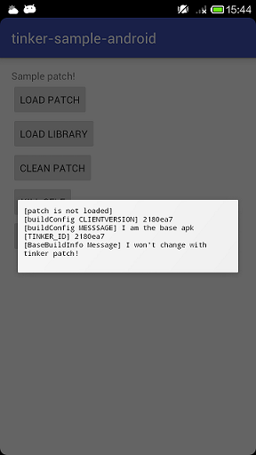
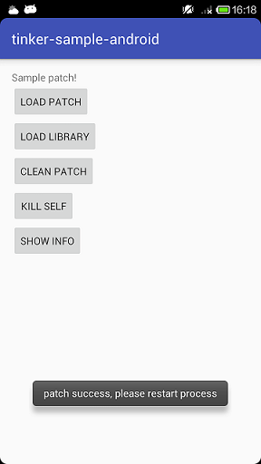

Tinker 接入指南          
====================================
## gradle接入
gradle是推荐的接入方式，在gradle插件`tinker-patch-gradle-plugin`中我们帮你完成proguard、multiDex以及Manifest处理等工作。

### 添加gradle依赖
在项目的[build.gradle](https://github.com/Tencent/tinker/blob/master/tinker-sample-android/build.gradle)中，添加`tinker-patch-gradle-plugin`的依赖 

```gradle
buildscript {
    dependencies {
        classpath ('com.tencent.tinker:tinker-patch-gradle-plugin:1.7.0')
    }
}
```

然后在app的gradle文件[app/build.gradle](https://github.com/Tencent/tinker/blob/master/tinker-sample-android/app/build.gradle)，我们需要添加tinker的库依赖以及apply tinker的gradle插件.

```gradle
dependencies {
	//可选，用于生成application类 
	compile('com.tencent.tinker:tinker-android-anno:1.7.0')
    //tinker的核心库
    compile('com.tencent.tinker:tinker-android-lib:1.7.0') 
}
...
...
//apply tinker插件
apply plugin: 'com.tencent.tinker.patch'
```

### gradle参数详解
我们将原apk包称为基准apk包，tinkerPatch直接使用基准apk包与新编译出来的apk包做差异，得到最终的补丁包。gradle配置的参数详细解释如下：

| 参数               | 默认值      | 描述       | 
| ----------------- | ---------  | ---------  | 
| `tinkerPatch`       |            | 全局信息相关的配置项         |
| oldApk            | null  | 基准apk包的路径，必须输入，否则会报错。 |
| ignoreWarning     | false | 如果出现以下的情况，并且ignoreWarning为false，我们将中断编译。因为这些情况可能会导致编译出来的patch包带来风险：<br> 1. minSdkVersion小于14，但是`dexMode`的值为"raw";<br> 2. 新编译的安装包出现新增的四大组件(Activity, BroadcastReceiver...)；<br> 3. 定义在dex.loader用于加载补丁的类不在main dex中;<br> 4. 定义在dex.loader用于加载补丁的类出现修改；<br> 5. resources.arsc改变，但没有使用applyResourceMapping编译。|
| useSign            | true |在运行过程中，我们需要验证基准apk包与补丁包的签名是否一致，我们是否需要为你签名。|
| `buildConfig`        |  | 编译相关的配置项   |     
| applyMapping       | null | 可选参数；在编译新的apk时候，我们希望通过保持旧apk的proguard混淆方式，从而减少补丁包的大小。这个只是推荐的，但`设置applyMapping会影响任何的assemble编译`。 |     
| applyResourceMapping  | null | 可选参数；在编译新的apk时候，我们希望通过旧apk的`R.txt`文件保持ResId的分配，这样不仅`可以减少补丁包的大小`，同时也`避免由于ResId改变导致remote view异常`。 |     
| tinkerId         | null  | 在运行过程中，我们需要验证基准apk包的tinkerId是否等于补丁包的tinkerId。这个是决定补丁包能运行在哪些基准包上面，一般来说我们可以使用git版本号、versionName等等。|     
| `dex`               |   | dex相关的配置项 | 
| dexMode            | jar  | 只能是'raw'或者'jar'。 <br>对于'raw'模式，我们将会保持输入dex的格式。<br>对于'jar'模式，我们将会把输入dex重新压缩封装到jar。如果你的minSdkVersion小于14，你必须选择‘jar’模式，而且它更省存储空间，但是验证md5时比'raw'模式耗时()。 | 
| usePreGeneratedPatchDex   | flase  | 是否提前生成dex，而非合成的方式。这套方案即回退成Qzone的方案，对于需要使用`加固或者多flavor打包的用户`可使用。但是这套方案需要插桩，会造成`Dalvik下性能损耗以及Art补丁包可能过大的问题，务必谨慎使用`。 | 
| pattern            | []  | 需要处理dex路径，支持\*、?通配符，必须使用'/'分割。路径是相对安装包的，例如/assets/...| 
| loader             |  [] | 这一项非常重要，它定义了哪些类在加载补丁包的时候会用到。这些类是通过Tinker无法修改的类，也是一定要放在main dex的类。<br>这里需要定义的类有：<br> 1. 你自己定义的Application类；<br> 2. Tinker库中用于加载补丁包的部分类，即com.tencent.tinker.loader.\*； <br> 3. 如果你自定义了TinkerLoader，需要将它以及它引用的所有类也加入loader中；<br> 4. 其他一些你不希望被更改的类，例如Sample中的BaseBuildInfo类。| 
| `lib`                |   | lib相关的配置项 | 
| pattern            | [] | 需要处理lib路径，支持\*、?通配符，必须使用'/'分割。与dex.pattern一致, 路径是相对安装包的，例如/assets/...| 
| `res`                |   | res相关的配置项 | 
| pattern            | [] | 需要处理res路径，支持\*、?通配符，必须使用'/'分割。与dex.pattern一致, 路径是相对安装包的，例如/assets/...，`务必注意的是，只有满足pattern的资源才会放到合成后的资源包。`| 
| ignoreChange         | [] | 支持\*、?通配符，必须使用'/'分割。若满足ignoreChange的pattern，在编译时会忽略该文件的新增、删除与修改。| 
| largeModSize         | 100| 对于修改的资源，如果大于largeModSize，我们将使用bsdiff算法。这可以降低补丁包的大小，但是会增加合成时的复杂度。默认大小为100kb| 
| `packageConfig`     |   | 用于生成补丁包中的'package_meta.txt'文件 | 
| configField        |  TINKER_ID, NEW_TINKER_ID | configField("key", "value"), 默认我们自动从基准安装包与新安装包的Manifest中读取tinkerId,并自动写入configField。在这里，你可以定义其他的信息，在运行时可以通过TinkerLoadResult.getPackageConfigByName得到相应的数值。但是建议直接通过修改代码来实现，例如BuildConfig。 | 
| `sevenZip`      |   | 7zip路径配置项，执行前提是useSign为true | 
| zipArtifact   | null  | 例如"com.tencent.mm:SevenZip:1.1.10"，将自动根据机器属性获得对应的7za运行文件，推荐使用。 | 
| path          | 7za | 系统中的7za路径，例如"/usr/local/bin/7za"。path设置会覆盖zipArtifact，若都不设置，将直接使用7za去尝试。| 

具体的参数设置事例可参考sample中的[app/build.gradle](https://github.com/Tencent/tinker/blob/master/tinker-sample-android/app/build.gradle)。

### tinkerPatch task详解
直接使用`task:tinkerPatchVariantName`(例如tinkerPatchDebug、tinkerPatchRelease)即可自动根据Variant选择相应的编译类型，同时它还贴心的为我们完成以下几个操作：

1. 将TINKER_ID自动插入AndroidManifest的meta项，输出路径为build/intermediates/tinker_intermediates/AndroidManifest.xml;

2. 如果minifyEnabled为true，将自动将Tinker的proguard规则添加到proguardFiles中，输出路径为build/intermediates/tinker_intermediates/tinker_proguard.pro;

3. 如果multiDexEnabled为true，将自动生成Tinker需要放在主dex的keep规则，你需要手动将生成规则拷贝到自己的multiDexKeepProguard文件中。这是因为它是一个单独的文件，而proguardFiles是一个list。例如Sample中的`multiDexKeepProguard file("keep_in_main_dex.txt")`。

4. 把dexOptions的jumboMode打开。

输出路径为：build/intermediates/tinker_intermediates/tinker_multidexkeep.pro。
后你可以在`build/outputs/tinkerPatch`中找到输出的文件。

### 多Flavor打包
有的时候我们希望通过flavor方式打包，在sample中提供了简单的用法事例：

1.通过flavor编译，这个时候我们可以看到bakApk路径是一个按照flavor名称区分的目录；

2.将编译目录路径填写到sample中`tinkerBuildFlavorDirectory`，其他的几个字段不需要填写，这里会自动根据路径拼接;  
```xml
ext {
    tinkerBuildFlavorDirectory = "${bakPath}/app-1014-13-35-12"
}
```

3.运行`tinkerPatchAllFlavorDebug`或者`tinkerPatchAllFlavorRelease`即可得到所有flavor的补丁包。

## 输出文件详解
在tinkerPatch输出目录`build/outputs/tinkerPatch`中，我们关心的文件有：

| 文件名               |描述       | 
| -----------------   | ---------  |
| patch_unsigned.apk  | 没有签名的补丁包          | 
| patch_signed.apk    | 签名后的补丁包  |
| patch_signed_7zip.apk| 签名后并使用7zip压缩的补丁包，也是我们通常使用的补丁包。但正式发布的时候，最好不要以`.apk`结尾，防止被运营商挟持。 | 
| log.txt| 在编译补丁包过程的控制台日志 | 
| dex_log.txt| 在编译补丁包过程关于dex的日志 | 
| so_log.txt| 在编译补丁包过程关于lib的日志 | 
| tinker_result| 最终在补丁包的内容，包括diff的dex、lib以及assets下面的meta文件 | 
| resources_out.zip| 最终在手机上合成的全量资源apk，你可以在这里查看是否有文件遗漏 | 
| resources_out_7z.zip| 根据7zip最终在手机上合成的全量资源apk | 
| tempPatchedDexes| 在Dalvik与Art平台，最终在手机上合成的完整Dex，**我们可以在这里查看dex合成的产物。** | 

**每次编译结束，我们都应该查看相关日志，清楚最终在补丁包中的文件。尤其是dex的补丁文件，即使是1k的dex补丁文件，也会带来合成时的时间损耗以及合成完整dex文件ROM空间体积这两部分影响！**

## 命令行接入
命令行工具`tinker-patch-cli.jar`提供了基准包与新安装包做差异，生成补丁包的功能。具体的命令参数如下:

```java
java -jar tinker-patch-cli.jar -old old.apk -new new.apk -config tinker_config.xml -out output_path
```

参数与gradle基本一致，新增的sign参数，我们需要输入签名路径与签名信息。

与gradle不同的是，在编译时我们需要将TINKER_ID插入到AndroidManifest.xml中。例如

```xml
<meta-data android:name="TINKER_ID" android:value="tinker_id_b168b32"/>
```

同时，我们需要自己保证proguard文件以及main dex类是正确的。具体配置可参考以下几个文件：

* [tinker_config.xml](https://github.com/Tencent/tinker/blob/master/tinker-build/tinker-patch-cli/tool_output/tinker_config.xml) 实例
* [tinker_proguard.pro](https://github.com/Tencent/tinker/blob/master/tinker-build/tinker-patch-cli/tool_output/tinker_proguard.pro) proguard配置实例
* [tinker_multidexkeep.pro](https://github.com/Tencent/tinker/blob/master/tinker-build/tinker-patch-cli/tool_output/tinker_multidexkeep.pro) main dex配置实例

### 如何快速获得依赖包
使用`tinker-git:buildSdk`任务即可在根目录的`buildSdk`文件夹中获得所有需要的文件。

其中包括：

1. build; 编译时用到的工具，主要是tinker-patch-cli.jar以及一些可能用到的配置信息；
2. android；需要放到手机端的依赖库，其中`tinker-android-anno.jar`为可选库，只有用到Tinker的annotation的才需要引入。

## 使用步骤详解

### Sample的使用方法
Demo请参考[tinker-sample-android](https://github.com/Tencent/tinker/tree/master/tinker-sample-android), 它的使用方法如下：

1.  调用`assembleDebug`编译，我们会将编译过的包保存在build/bakApk中。然后我们将它安装到手机，点击`SHOW INFO`按钮，可以看到补丁并没有加载.
 
	

2. 修改代码，例如将[MainActivity](https://github.com/Tencent/tinker/blob/master/tinker-sample-android/app/src/main/java/tinker/sample/android/app/MainActivity.java)中`I am on patch onCreate`的Log打开。然后我们需要修改[build.gradle](https://github.com/Tencent/tinker/blob/master/tinker-sample-android/build.gradle)中的参数，将步骤一编译保存的安装包路径拷贝到`tinkerPatch`中的`oldApk`参数中。

	

3. 调用`tinkerPatchDebug`, 补丁包与相关日志会保存在`/build/outputs/tinkerPatch/`。然后我们将`patch_signed_7zip.apk`推送到手机的sdcard中。

	```java
	adb push ./app/build/outputs/tinkerPatch/debug/patch_signed_7zip.apk /storage/sdcard0/
	```

4. 点击`LOAD PATCH`按钮, 如果看到`patch success, please restart process`的toast，即可锁屏或者点击`KILL SELF`按钮 

	

5. 我们可以看到的确出现了`I am on patch onCreate`日志，同时点击`SHOW INFO`按钮，显示补丁包的确已经加载成功了。 
 
	

### Release的使用方法
Tinker的使用方式如下，以gradle接入的release包为例：

1. 每次编译或发包将安装包与mapping文件备份；
2. 若有补丁包的需要，按自身需要修改你的代码、库文件等；
3. 将备份的基准安装包与mapping文件输入到tinkerPatch的配置中；
4. 运行tinkerPatchRelease，即可自动编译最新的安装包，并与输入基准包作差异，得到最终的补丁包。

## 调试源码
tinker调试源码非常简单，只需要运行tinker项目中`buildAndPublishLocalMaven`任务即可。

总的来说，我们更推荐使用gradle作为接入方式。然后我们继续学习如何[Tinker 自定义扩展](https://github.com/Tencent/tinker/wiki/Tinker-%E8%87%AA%E5%AE%9A%E4%B9%89%E6%89%A9%E5%B1%95)。